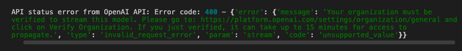

# agno
This repo holds the content from my [agno](https://www.agno.com/) youtube playlist
---
## Setup

### 1. Install [uv](https://docs.astral.sh/uv/)
```bash
curl -LsSf https://astral.sh/uv/install.sh | sh
```

### 2. Clone and Initialize
```bash
git clone https://github.com/sudarshan-koirala/agno.git
cd agno
uv sync
```

### 3. Environment Variables
Create a `.env` file:
```bash
touch .env
# Edit .env with your values
```

## Usage

### Run your code
```bash
#Example
uv run python agent.py
```

### Add packages if needed
```bash
uv add package-name
```

#### You might need to verify your organization to access protected models from OpenAI



## References
- https://docs.agno.com/introduction
- https://docs.agno.com/introduction/quickstart
- https://docs.agno.com/agent-os/introduction
